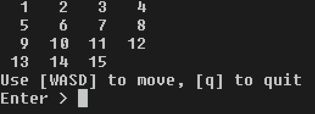
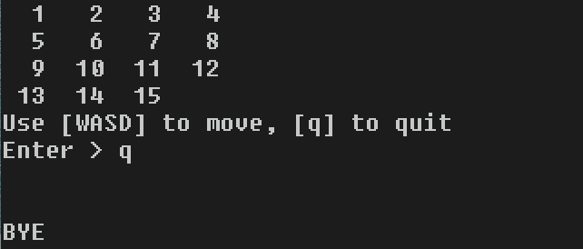
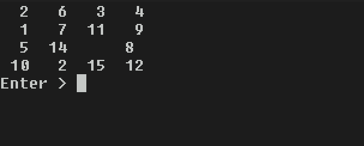

# fifpuz 

Fifteen Puzzle in C++. 

<p float="left" align="middle">
  
   
  
</p>

## To build:

```
1. Install g++ (& libstdc++-<xx>-dev), make, cmake.
2. Run ./build.sh
[Run the commands below]
3. cd out
4. make
5. ./fifpuz
```
